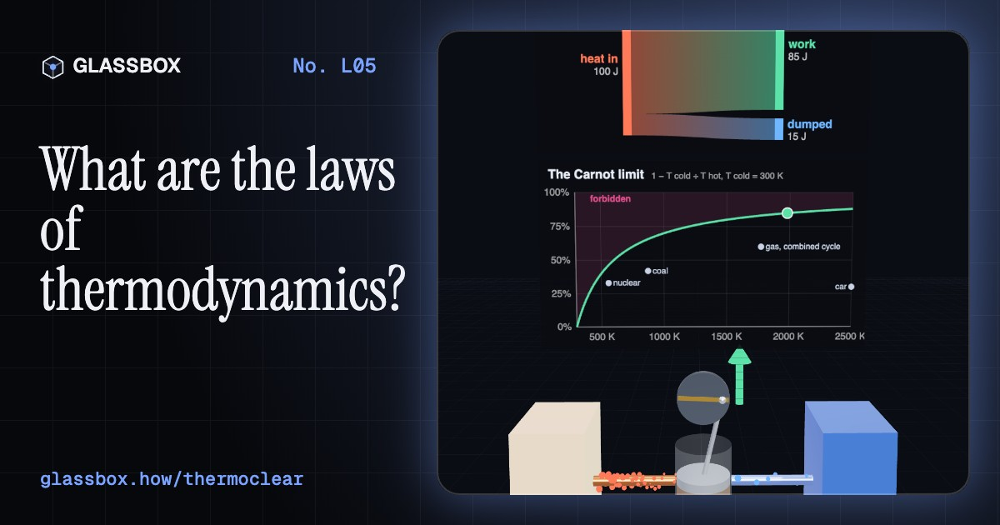
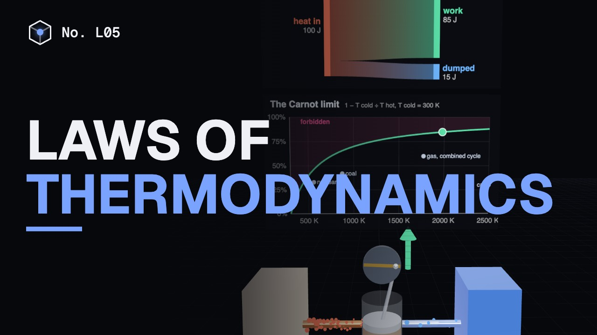
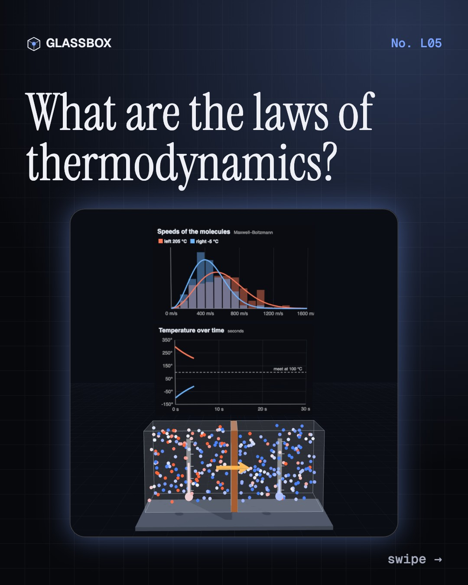
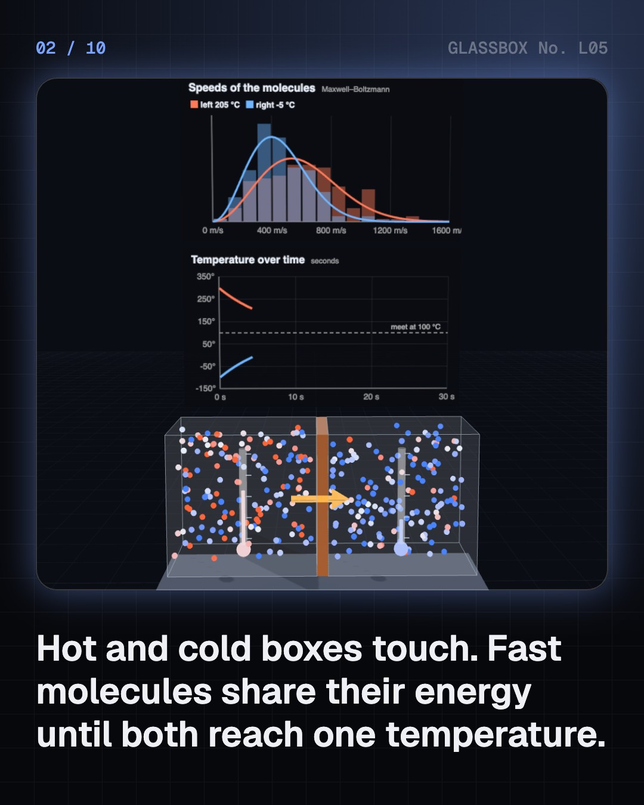
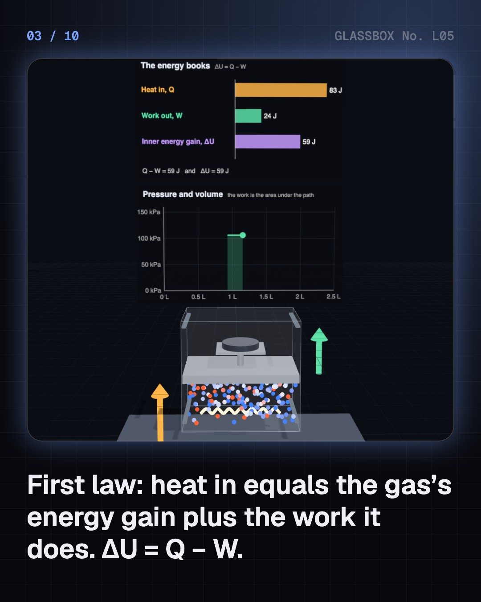
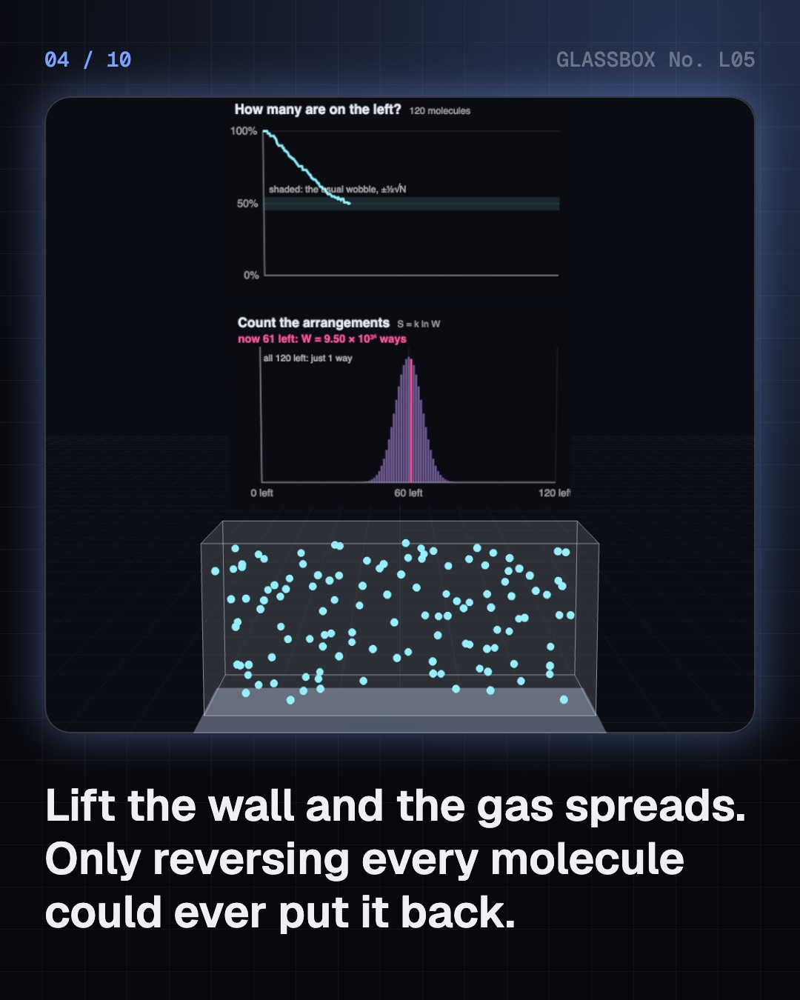

<!-- glassbox:start -->
<!-- Generated from glassbox.json by the Glassbox hub (npm run readme -- thermoclear). Edit glassbox.json, not this block. -->
<p align="center"><a href="https://glassbox-production-fd52.up.railway.app/e/thermoclear/"></a></p>

<h1 align="center">The laws of thermodynamics</h1>

<p align="center"><b>What are the laws of thermodynamics?</b><br>Heat flows downhill, energy always balances, no engine is perfect and absolute zero is out of reach. Watch hot and cold molecules share their speed, push a piston with a heater, run Carnot's perfect engine, pump heat uphill with an AC, and meet Maxwell's demon.</p>

<p align="center"><a href="https://glassbox-production-fd52.up.railway.app/thermoclear/"><b>▶ Play with it</b></a> &nbsp;·&nbsp; <a href="https://glassbox-production-fd52.up.railway.app/e/thermoclear/">Read the 60-second explainer</a> &nbsp;·&nbsp; <a href="https://glassbox-production-fd52.up.railway.app/thermoclear/glassbox/reel.mp4">Watch the 40-second video</a></p>

<p align="center">
  <a href="https://glassbox-production-fd52.up.railway.app/e/thermoclear/"></a>
  <a href="https://glassbox-production-fd52.up.railway.app/e/thermoclear/"></a>
  <a href="LICENSE"></a>
  <a href="LICENSE-CONTENT.md"></a>
  <a href="#privacy"></a>
</p>

## In 60 seconds

1. **Temperature is jiggling, and heat flows downhill.** Air molecules at 20 °C fly at about 500 m/s. Put a hot box against a cold one and the fast molecules share their energy until both reach one temperature: the zeroth law. Heat never flows back from cold to hot by itself: the second law.
2. **The energy books: ΔU = Q − W.** Heat a gas under a piston and part of the heat raises its internal energy while the rest pushes the piston as work. For air at steady pressure, 2/7 of the heat becomes work. Lock the piston and all of it warms the gas.
3. **No engine can be perfect.** Heat does work only while flowing from hot to cold, and some must always be dumped. Carnot's limit is 1 − T_cold ÷ T_hot in kelvin: 88% for a car's burning gas, but real engines reach about 30%.
4. **Pumping heat uphill costs work.** An AC or fridge moves heat from cold to hot and pays in electricity. Heat out = heat taken + electricity. The smaller the temperature gap, the more heat each unit moves, up to Carnot's T_cold ÷ (T_hot − T_cold).
5. **Entropy, the demon and absolute zero.** Spread-out arrangements vastly outnumber tidy ones, so entropy grows. Maxwell's demon can sort molecules, but wiping its memory costs more entropy than it saves. And every cooling step leaves something: 0 K is never reached.

## Words worth knowing

| Term | Meaning |
|---|---|
| **Temperature** | How fast molecules jiggle on average. In kelvin it starts at absolute zero, −273.15 °C. |
| **Heat (Q)** | Energy that flows because of a temperature difference, by itself always from hotter to colder. |
| **Work (W)** | Energy passed on by a push through a distance, like gas pushing a piston. |
| **Internal energy (U)** | All the jiggling and spinning energy of the molecules inside something. |
| **Thermal equilibrium** | Things in touch at the same temperature, with no more heat flowing between them. |
| **Entropy (S)** | A count of the ways energy and molecules can be arranged, S = k ln W. Left alone, it only grows. |
| **Carnot limit** | The best efficiency any heat engine can have: 1 − T_cold ÷ T_hot, in kelvin. |
| **Absolute zero** | 0 K, the coldest possible temperature. You can get ever closer but never reach it. |

## A short history

**From a warm glass bulb in Padua to atoms a few trillionths of a degree above absolute zero: 400 years of learning what heat is and where it can go.**

- **1593** · A glass bulb that shows heat (Galileo Galilei, Padua, Republic of Venice)
- **1824** · The perfect engine on paper (Sadi Carnot, Paris)
- **1845** · Paddle wheels and the price of heat (James Prescott Joule, Manchester, England)
- **1850** · The first and second laws, written down (Rudolf Clausius, Berlin, Prussia)
- **1865** · A new word: entropy (Rudolf Clausius, Zürich)
- **1877** · Entropy is counting (Ludwig Boltzmann, Graz, Austria)
- **1906** · The third law: you can never reach absolute zero (Walther Nernst, Berlin)

The full story, with 20 moments, charts, people and 30 sources: [glassbox.how/e/thermoclear/history](https://glassbox-production-fd52.up.railway.app/e/thermoclear/history/). The data lives in [`history.json`](history.json).

## Video and slides

Made with the Glassbox studio from this box's storyboard (`window.glassbox.director`). Free to reuse under CC BY 4.0.

<a href="https://glassbox-production-fd52.up.railway.app/thermoclear/glassbox/video.mp4"></a>

<p><a href="glassbox/slide-1.jpg"></a> <a href="glassbox/slide-2.jpg"></a> <a href="glassbox/slide-3.jpg"></a> <a href="glassbox/slide-4.jpg"></a></p>

| File | What | Size |
|---|---|---|
| [`glassbox/reel.mp4`](https://glassbox-production-fd52.up.railway.app/thermoclear/glassbox/reel.mp4) | Reel / Short, with captions and soundtrack | 1080×1920 |
| [`glassbox/video.mp4`](https://glassbox-production-fd52.up.railway.app/thermoclear/glassbox/video.mp4) | YouTube video, with captions and soundtrack | 1920×1080 |
| `glassbox/slide-1…10.jpg` | Instagram carousel | 1080×1350 |
| `glassbox/thumb.jpg` | YouTube thumbnail | 1280×720 |
| `glassbox/cover.jpg` | Share card and repo social preview | 1200×630 |
| [`glassbox/history-reel.mp4`](https://glassbox-production-fd52.up.railway.app/thermoclear/glassbox/history-reel.mp4) | “History in 10 moments” Reel / Short | 1080×1920 |
| `glassbox/history-slide-*.jpg` | History carousel | 1080×1350 |
| `glassbox/post.json` | Post copy and schedule used by the publish kit | |

## Privacy

This box has no accounts and no ads, and it ships its own fonts and libraries. When you run it yourself it sends nothing anywhere. On glassbox.how, the site's `/bar.js` also loads Glassbox's analytics: **Google Analytics** to count visits (it asks first in the EU, UK and Switzerland, and stays off when your browser sends Global Privacy Control or Do Not Track) and **ClickTrust** to detect bots.

It remembers a few things **in your own browser only**, and never sends them anywhere:

| Browser storage key | What it holds |
|---|---|
| `thermoclear.v1` | Which chapters you have opened, your best quiz scores, and sound on or off. |

Exactly what each one sees is at [glassbox.how/privacy](https://glassbox-production-fd52.up.railway.app/privacy/).

## Licences

- **Code:** [MIT](LICENSE). Use it, change it, ship it.
- **Explanations, text, images and videos** (`glassbox.json`, `glassbox/`): [CC BY 4.0](LICENSE-CONTENT.md). Credit “Glassbox, glassbox.how/e/thermoclear”.
- **Third-party parts** keep their own licences: [three.js](https://threejs.org) (MIT), [Geist, Instrument Serif](https://openfontlicense.org) (SIL OFL 1.1).
- The Glassbox name and logo aren't covered by either licence. See the [terms](https://glassbox-production-fd52.up.railway.app/terms/).

Found a mistake? [Open an issue](https://github.com/bdeeps/thermoclear/issues). Corrections happen in public.
<!-- glassbox:end -->

## Run it

It's plain HTML, CSS and JavaScript. No build step and no dependencies. Run locally, it contacts no other website.

```bash
python3 -m http.server 8000
```

Three.js and the fonts ship in `vendor/` and `fonts/`, so it also works offline.

Then open http://localhost:8000.

## How it's built

| File | What |
|---|---|
| `index.html`, `css/app.css` | The page and its styles |
| `js/app.js`, `js/stage.js`, `js/ui.js`, `js/kit.js` | The shared Glassbox 3D engine: chapters, 3D stage, controls, quiz, video director |
| `js/chapters/*.js` | One file per chapter: the 3D model, controls, text, key terms, quiz and video scenes |
| `glassbox.json` | Title, question, explainer beats, key terms, browser storage and credits shown on glassbox.how |
| `reel` in each chapter | The storyboard the Glassbox studio records into short videos |
| `glassbox/` | The published video, slides, thumbnail and post copy |
| `fonts/`, `vendor/three/` | Self-hosted Geist and Instrument Serif (SIL OFL 1.1) and three.js (MIT) |
